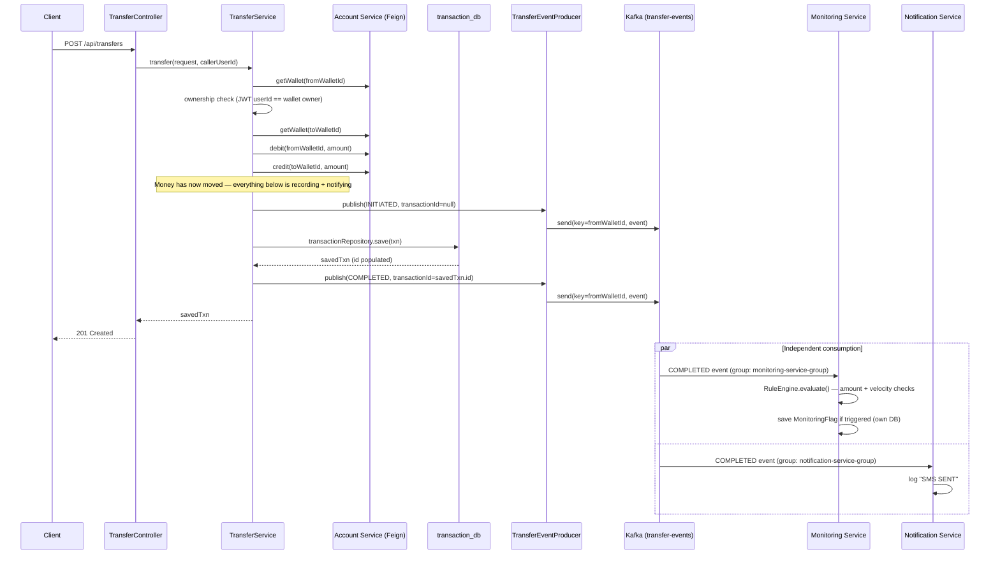

# 🧩 Phase 10 — Kafka Event-Driven Communication: Full Flow Documentation

> Built from your actual code — every class name, field, and config value below is what's really running in your project, not a template. Two real bugs hit during this phase are documented as part of the flow, since debugging them taught the underlying mechanics better than clean code would have.

---

## 1️⃣ What Changed in the Architecture

Before this phase, every service-to-service interaction was synchronous: Transaction Service called Account Service via Feign and waited for a response (Phase 9). Phase 10 adds a second, parallel kind of communication — **asynchronous, fire-and-forget events** — without touching that existing synchronous path at all.

```
                    ┌─────────────────────┐
  Client ──POST──▶  │  Transaction Service │
                    └──────────┬───────────┘
                               │
                 (unchanged, synchronous, Phase 9)
                               │
                               ▼
                    ┌─────────────────────┐
                    │   Account Service     │  ← debit/credit via Feign
                    └─────────────────────┘

                               │
                 (NEW, asynchronous, Phase 10)
                               │
                               ▼
                    ┌─────────────────────┐
                    │        Kafka          │  topic: transfer-events
                    │   (transfer-events)   │
                    └───┬─────────────┬─────┘
                        │             │
                        ▼             ▼
              ┌──────────────┐  ┌──────────────────┐
              │ monitoring-   │  │ notification-     │
              │ service       │  │ service            │
              └──────────────┘  └──────────────────┘
```

Two new services (`monitoring-service`, `notification-service`) were added. Both are **independent Kafka consumers** — they don't know about each other, don't know Transaction Service exists beyond "something publishes to `transfer-events`," and one being down never affects the other or the transfer itself.

---

## 2️⃣ Services Involved and Their Real Role

| Service | Kafka role | What it actually does |
|---|---|---|
| `transaction-service` | **Producer** | Publishes `INITIATED` and `COMPLETED` events after a transfer |
| `monitoring-service` | **Consumer** | Reads events, applies amount/velocity rules, saves flags to its own DB |
| `notification-service` | **Consumer** | Reads events, logs a simulated SMS/email |
| `account-service`, `config-server`, `eureka-server`, `api-gateway-service` | **None** | Untouched — no Kafka dependency, no producer or consumer role |

Consumer groups (from your actual config):
- `monitoring-service-group` (or `monitor-service-group` — **check this exact string matches** between your `-local.yml` and your `@KafkaListener` annotation; a typo here silently creates a second, orphaned consumer group rather than erroring)
- `notification-service-group`

**Why different group IDs matter, concretely:** if both services shared one group ID, Kafka would split the 2 messages between them — each service would only see roughly half the events. Separate group IDs is what makes both services get their *own full copy* of everything published.

---

## 3️⃣ Full Request Lifecycle — Traced Through Your Real Code

### Step 1 — Client sends the request

```
POST /api/transfers
{ "fromWalletId": 1, "toWalletId": 2, "amount": 10.00 }
```

Hits `TransferController.transfer()`:

```java
@PostMapping("/transfers")
public ResponseEntity<TransactionResponse> transfer(@Valid @RequestBody TransferRequest request) {
    Long callerUserId = securityUtils.getCurrentUserId();
    Transaction txn = transferService.transfer(request, callerUserId);
    return ResponseEntity.status(HttpStatus.CREATED).body(toResponse(txn));
}
```

`@Valid` triggers the Bean Validation annotations on `TransferRequest` (`@NotNull`, `@PositiveAmount`) before this method body even runs — invalid input never reaches `TransferService` at all (Phase 4's exception handling still applies here, unchanged).

`securityUtils.getCurrentUserId()` pulls the caller's identity from the JWT (Phase 2) — this is what makes the ownership check in the next step possible.

### Step 2 — `TransferService.transfer()` runs, inside `@Transactional`

```java
@Transactional
public Transaction transfer(TransferRequest request, Long callerUserId) {
```

**a) Guard clause — no self-transfers:**
```java
if (request.getFromWalletId().equals(request.getToWalletId())) {
    throw new IllegalArgumentException("Cannot transfer to the same wallet");
}
```

**b) Fetch the source wallet via Feign (Phase 9's `AccountServiceClient`):**
```java
WalletResponse fromWallet = accountServiceClient.getWallet(request.getFromWalletId());
```

**c) Ownership check — prevents IDOR (Phase 2's lesson, still enforced here):**
```java
if (!fromWallet.getUserId().equals(callerUserId)) {
    throw new ResponseStatusException(HttpStatus.FORBIDDEN, "Access denied: source wallet does not belong to you");
}
```

**d) Fetch destination wallet, then perform the actual money movement — still via Feign, still synchronous, still protected by Resilience4j from Phase 9:**
```java
WalletResponse toWallet = accountServiceClient.getWallet(request.getToWalletId());
accountServiceClient.debit(fromWallet.getId(), request.getAmount());
accountServiceClient.credit(toWallet.getId(), request.getAmount());
```

At this point, **the money has already moved.** Everything from here on is about recording what happened and telling the rest of the system — none of it can undo the transfer if it fails (that gap is explicitly Phase 11's problem, not this phase's).

**e) Build the `Transaction` object — not saved yet, so it has no `id`:**
```java
Transaction txn = Transaction.builder()
        .fromWalletId(fromWallet.getId())
        .toWalletId(toWallet.getId())
        .amount(request.getAmount())
        .type(TransactionType.TRANSFER)
        .status(TransactionStatus.PENDING)
        .build();
```

### Step 3 — First Kafka publish: `INITIATED`

```java
transferEventProducer.publish(TransferEvent.builder()
        .eventType("INITIATED")
        .fromWalletId(request.getFromWalletId())
        .toWalletId(request.getToWalletId())
        .amount(request.getAmount())
        .timestamp(Instant.now())
        .build());
```

**Why `transactionId` is correctly `null` here:** the `Transaction` row doesn't exist in the database yet — `@GeneratedValue(strategy = GenerationType.IDENTITY)` on the `Transaction` entity means the ID is only assigned by Postgres at `INSERT` time, which hasn't happened yet. This is expected, not a bug.

### Step 4 — Ledger entries built, transaction marked SUCCESS, then **saved**

```java
LedgerEntry debit = LedgerEntry.builder()
        .walletId(fromWallet.getId()).transaction(txn).amount(request.getAmount())
        .type(LedgerEntryType.DEBIT).description("Transfer to wallet " + toWallet.getId()).build();
LedgerEntry credit = LedgerEntry.builder()
        .walletId(toWallet.getId()).transaction(txn).amount(request.getAmount())
        .type(LedgerEntryType.CREDIT).description("Transfer from wallet " + fromWallet.getId()).build();
txn.addLedgerEntry(debit);
txn.addLedgerEntry(credit);
txn.setStatus(TransactionStatus.SUCCESS);

Transaction savedTxn = transactionRepository.save(txn);
```

**This save must happen before the second publish** — this is the fix for a real bug hit during this phase (documented in Section 6). `savedTxn.getId()` is now populated, because `save()` is exactly the operation that triggers the `INSERT` and gets the generated ID back from Hibernate.

### Step 5 — Second Kafka publish: `COMPLETED`

```java
transferEventProducer.publish(TransferEvent.builder()
        .eventType("COMPLETED")
        .transactionId(savedTxn.getId())
        .fromWalletId(request.getFromWalletId())
        .toWalletId(request.getToWalletId())
        .amount(request.getAmount())
        .timestamp(Instant.now())
        .build());

return savedTxn;
```

### Step 6 — Inside `TransferEventProducer.publish()`

```java
public void publish(TransferEvent event) {
    String key = String.valueOf(event.getFromWalletId());

    kafkaTemplate.send(TOPIC, key, event)
            .whenComplete((result, ex) -> {
                if (ex != null) {
                    log.error("Failed to publish {} event for transactionId={}", ...);
                } else {
                    log.info("Published {} event for transactionId={} to partition={}", ...);
                }
            });
}
```

**Why keyed by `fromWalletId`:** Kafka guarantees ordering only *within* a partition, and the partition a message lands in is determined by its key. By keying on `fromWalletId`, every event for the same wallet — across both INITIATED and COMPLETED, across every transfer that wallet ever makes — always lands in the same partition, in the order they were sent. This is exactly what your logs showed: both events landed in `partition=0` for wallet `1`.

`kafkaTemplate.send()` is **asynchronous** — it returns a `CompletableFuture` immediately, and `TransferService.transfer()` does **not** wait for Kafka to confirm delivery before returning to the client. This is intentional: the client gets their "transfer successful" response the moment the DB save completes, without waiting on Kafka at all. `.whenComplete()` just logs success/failure in the background, after the response has likely already gone out.

### Step 7 — Message lands in the `transfer-events` topic

At this point, the message exists as JSON bytes inside a Kafka partition on your broker (`localhost:9092`), tagged with the key (`"1"`) and, because `JsonSerializer` was used, a `__TypeId__` header containing `com.rahul.transaction_service.event.TransferEvent` — the producer's own class name. (This exact header is what caused Bug #1, in Section 6.)

### Step 8 — Monitoring Service consumes it independently

```java
@KafkaListener(topics = "transfer-events", groupId = "monitoring-service-group")
public void onTransferEvent(TransferEvent event) {
    log.info("Received {} event for transactionId={}", event.getEventType(), event.getTransactionId());
    if ("COMPLETED".equals(event.getEventType())) {
        ruleEngine.evaluate(event);
    }
}
```

Note this deliberately **ignores `INITIATED` events** — there's nothing useful to check about a transfer that hasn't actually completed yet. Only `COMPLETED` triggers rule evaluation.

Inside `RuleEngine.evaluate()`:
```java
public void evaluate(TransferEvent event) {
    checkAmountThreshold(event);
    checkVelocity(event);
}
```
- `checkAmountThreshold` — flags if `amount > ₹1,00,000`
- `checkVelocity` — tracks recent transfer timestamps per wallet **in memory**, flags if more than 3 transfers happened from the same wallet in the last 60 seconds

Any flag gets saved via `MonitoringFlagRepository.save(...)` into Monitoring Service's **own** database (`MonitoringService` on port 5435) — completely separate from `TransactionService`'s or `AccountService`'s databases, following the database-per-service pattern from Phase 5.

### Step 9 — Notification Service consumes it independently, in parallel

```java
@KafkaListener(topics = "transfer-events", groupId = "notification-service-group")
public void onTransferEvent(TransferEvent event) {
    if ("COMPLETED".equals(event.getEventType())) {
        notificationSimulator.notify(event);
    }
}
```

```java
public void notify(TransferEvent event) {
    log.info("📩 SMS SENT: ₹{} debited from wallet {} — transactionId={}", ...);
}
```

No database — just a log line, as agreed. This consumer runs completely independently of Monitoring Service; Kafka delivers a separate copy of the same message to each group.

---

## 4️⃣ Full Sequence Diagram



---

## 5️⃣ Config That Makes This Work

### Transaction Service (producer)
```yaml
spring:
  kafka:
    bootstrap-servers: localhost:9092
    producer:
      key-serializer: org.apache.kafka.common.serialization.StringSerializer
      value-serializer: org.springframework.kafka.support.serializer.JsonSerializer
```

### Monitoring Service (consumer) — final, working version
```yaml
spring:
  kafka:
    bootstrap-servers: localhost:9092
    consumer:
      group-id: monitoring-service-group
      auto-offset-reset: earliest
      key-deserializer: org.apache.kafka.common.serialization.StringDeserializer
      value-deserializer: org.springframework.kafka.support.serializer.JsonDeserializer
      properties:
        spring.json.use.type.headers: false
        spring.json.value.default.type: com.rahul.monitoring_service.event.TransferEvent
        spring.json.trusted.packages: "com.rahul.monitoring_service.event"
```

### Notification Service (consumer) — final, working version
```yaml
spring:
  kafka:
    bootstrap-servers: localhost:9092
    consumer:
      group-id: notification-service-group
      auto-offset-reset: earliest
      key-deserializer: org.apache.kafka.common.serialization.StringDeserializer
      value-deserializer: org.springframework.kafka.support.serializer.JsonDeserializer
      properties:
        spring.json.use.type.headers: false
        spring.json.value.default.type: com.rahul.notification_service.event.TransferEvent
        spring.json.trusted.packages: "com.rahul.notification_service.event"
```

**`auto-offset-reset: earliest`** — if a consumer group has never read from this topic before (brand new group, or the topic existed before the consumer did), start from the very first message rather than only new ones. Useful while developing/testing, since you don't lose messages published before a consumer happened to be running.

---

## 6️⃣ Two Real Bugs Hit in This Phase — and Why They Happened

These aren't hypothetical "gotchas" — both actually broke your running services during this build, and understanding *why* is more valuable than the fix itself.

### Bug 1 — `ClassNotFoundException` on the consumer side

**Symptom:**
```
Caused by: java.lang.ClassNotFoundException: com.rahul.transaction_service.event.TransferEvent
```
appearing inside **Monitoring Service's** logs.

**Root cause:** `JsonSerializer` (producer side) automatically stamps a `__TypeId__` header on every message containing the exact class name of the object being sent — in this case, Transaction Service's own `TransferEvent`, at `com.rahul.transaction_service.event.TransferEvent`. By default, `JsonDeserializer` (consumer side) trusts that header and tries to load a class with that *exact* name. But Monitoring Service doesn't have that class — it has its own separate copy at `com.rahul.monitoring_service.event.TransferEvent`. Same fields, different package, different class as far as Java's classloader is concerned.

This is the direct cost of the architectural decision to **duplicate the event class per service** rather than share one class via a common library — a normal, common microservices trade-off, but one that requires this specific fix.

**Fix:** tell each consumer to stop trusting the producer's class name entirely, and always deserialize into its *own* local class:
```yaml
spring.json.use.type.headers: false
spring.json.value.default.type: com.rahul.monitoring_service.event.TransferEvent
```

**The follow-up mistake (worth naming honestly):** the first attempt at this fix was applied to *both* services but with the **same** package name (`monitoring_service`) copy-pasted into Notification Service's file by mistake — causing the identical error to reappear, just in the other service. The rule that prevents this: each service's `spring.json.value.default.type` must always reference a class inside *that same service's own codebase*, never another service's package.

### Bug 2 — `transactionId=null` on the COMPLETED event

**Symptom:** both Monitoring and Notification Service logged `transactionId=null` for the COMPLETED event — even though `INITIATED` correctly showing `null` was expected.

**Root cause — ordering bug in `TransferService.transfer()`:** the original code built and published the COMPLETED event using `txn.getId()`, **before** calling `transactionRepository.save(txn)`. Since `@GeneratedValue(strategy = GenerationType.IDENTITY)` only assigns an ID at the moment of the actual database `INSERT`, `txn.getId()` was still `null` at the point the event was built — the save simply hadn't happened yet.

**Fix:** reorder so `save()` happens first, capture the returned entity (which *does* have the generated ID), and publish COMPLETED using that:
```java
Transaction savedTxn = transactionRepository.save(txn);   // id generated here

transferEventProducer.publish(TransferEvent.builder()
        .transactionId(savedTxn.getId())                  // now correct
        ...
```

**The general lesson, worth remembering beyond this one bug:** with `IDENTITY`-strategy generated IDs, an entity's ID is only trustworthy *after* `save()` returns — never before, no matter how confident the code looks. Any logic that needs the ID (publishing an event, returning it in a response, logging it) must happen after the save, using the save's return value — not the original object reference.

---

## 7️⃣ What's Genuinely Done vs. Still Missing

Being explicit here so this doc doesn't overstate progress — per the original Phase 10 deliverables:

| Deliverable | Status |
|---|---|
| Every transfer emits INITIATED + COMPLETED events | ✅ Working, confirmed via logs |
| Monitoring Service independently consumes and can flag | ✅ Rule engine + DB persistence in place |
| Notification Service independently consumes and logs | ✅ Working |
| Correct `transactionId` on COMPLETED events | ✅ Fixed (Section 6, Bug 2) |
| Consumer deserialization working correctly | ✅ Fixed (Section 6, Bug 1) |
| **Idempotent consumers** (same event twice ⇒ no double-flag/double-notify) | ⬜ **Not built yet** |
| **Dead Letter Topic** for poison-pill messages | ⬜ **Not built yet** |
| Containerized (Docker) version tested | ⬜ **Not done yet** — still running all services locally from IntelliJ, Postgres in Docker, Kafka native |

The two ⬜ Kafka-specific items (idempotency, DLT) are the next concrete steps — both build directly on everything documented above, since they modify the `@KafkaListener` methods and consumer config you now understand in detail.